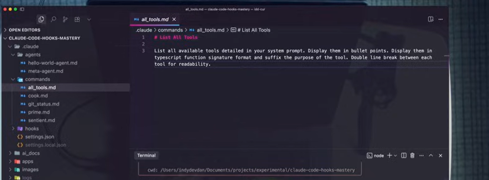
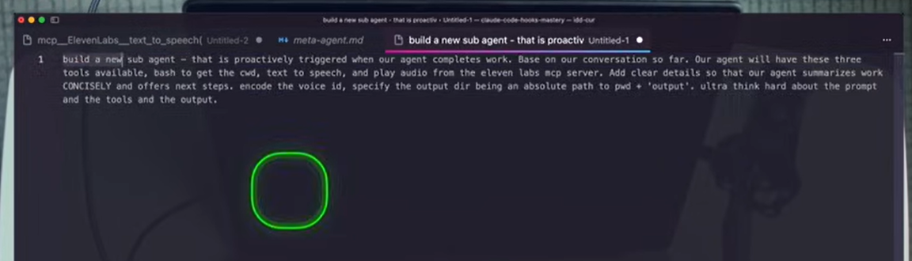

# Use powerful agent creation tools to build custom AI agents tailored to your development needs.

- Source: https://www.youtube.com/watch?v=7B2HJr0Y68g
  
##U se Agent Creator to create agent and ask it to use specific tools.

    1. You ask Claude to list tools available, for example, with ElevenLabs
        

    2. Once it lists, you find the tools that you want.
    3. Then, you give it a prompt to create the subagent and use those tools
        
    4. This meta agent creator agent will fire
        a. https://github.com/disler/claude-code-hooks-mastery/blob/main/.claude/agents/meta-agent.md
    5. It will then create agent like this, you will want to tweak the data a bit to fit your needs. Like Be concise
        a. https://github.com/disler/claude-code-hooks-mastery/blob/main/.claude/agents/work-completion-summary.md
    6. Proactively, IMPORTANT are some good key words!
